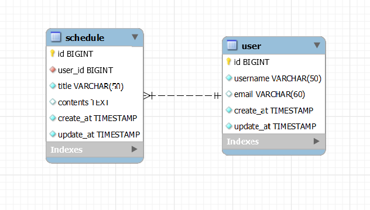

# Schedule Management Develop

## API 명세서

### Schedule

| 기능       |Method| URL                     | Request           | Response | 상태코드                                               |
|----------|---|-------------------------|-------------------|----------|----------------------------------------------------|
| 일정 저장    |`POST`| /schedules              | 요청 body           | 등록 정보    | 201: 정상 등록, 400: 비정상 값 , 401: 로그인되지 않음             |
| 전체 일정 조회 |`GET`| /schedules              | X                 | 다건 응답 정보 | 200: 정상 조회                                         |
| 선택 일정 조회 |`GET`| /schedules/{scheduleId} | 요청 param, 요청 body | 단건 응답 정보 | 200: 정상 조회, 404: 일정이 사라짐                           |
| 선택 일정 수정 |`PUT`| /schedules/{scheduleId} | 요청 param, 요청 body | 수정 정보    | 200: 정상 수정, 400: 비정상 값, 401: 작성자가 아님, 404: 일정이 사라짐 |
| 선택 일정 삭제 |`DELETE`| /schedules/{scheduleId} | 요청 param | X        | 204: 정상 삭제, 401: 작성자가 아님, 404: 일정이 사라짐             |

<details>
  <summary><b>일정 생성</b></summary>

- 기본정보

    <table>
      <tr>
        <td ><b>메소드</b></td>
        <td ><b>요청 URL</b></td>
      </tr>
      <tr>
        <td>POST</td></td>
        <td >/schedules</td>
      </tr>
    </table>


- 예제

    - 요청: POST /schedules

      ```json
      {
        "title": "자바객체 읽기",
        "contents": "orm 공부하기"
      }
      ```

    - 응답

      HTTP/1.1 201 Created

      ``` json
      {
        "id": 1,
        "title": "자바객체 읽기",
        "contents": "orm 공부하기"
      }
      ```

- 본문

    - 요청

      <table>
          <tr>
            <td><b>이름</b></td>
            <td><b>타입</b></td>
            <td><b>설명</b></td>
            <td><b>필수</b></td>
          </tr>
          <tr>
            <td>title</td>
            <td>String</td>
            <td>일정 제목</td>
            <td> O </td>
          </tr>
          <tr>
            <td>contents</td>
            <td>String</td>
            <td>일정 내용</td>
            <td> X </td>
          </tr>
        </table>

    - 응답

      <table>
          <tr>
            <td><b>이름</b></td>
            <td><b>타입</b></td>
            <td><b>설명</b></td>
            <td><b>필수</b></td>
          </tr>
          <tr>
            <td>id</td>
            <td>Long</td>
            <td>일정 ID</td>
            <td> O </td>
          </tr>
          <tr>
            <td>title</td>
            <td>String</td>
            <td>일정 제목</td>
            <td> O </td>
          </tr>
          <tr>
            <td>contents</td>
            <td>String</td>
            <td>일정 내용</td>
            <td> X </td>
          </tr>
        </table>

</details>

<details>
  <summary><b>전체 일정 조회</b></summary>

- 기본정보

    <table>
      <tr>
        <td ><b>메소드</b></td>
        <td ><b>요청 URL</b></td>
      </tr>
      <tr>
        <td>GET</td></td>
        <td >/schedules</td>
      </tr>
    </table>


- 예제

    - 요청: X

    - 응답

      HTTP/1.1 200 Ok

      ``` json
      [
        {
           "id": 1,
           "title": "강의 듣기",
           "contents": "2주차 강의",
           "createdAt" : "2024-11-24",
           "updatedAt" : "2024-11-24"
        },
        {
           "id": 2,
           "title": "과제",
           "contents": "0단계 작성",
           "createdAt" : "2024-11-24",
           "updatedAt" : "2024-11-24"
        },    ...
      ]
      ```

- 본문

    - 요청: X

    - 응답

        <table>
          <tr>
            <td><b>이름</b></td>
            <td><b>타입</b></td>
            <td><b>설명</b></td>
            <td><b>필수</b></td>
          </tr>
          <tr>
            <td>id</td>
            <td>Long</td>
            <td>일정 ID</td>
            <td> O </td>
          </tr>
          <tr>
            <td>title</td>
            <td>String</td>
            <td>일정 제목</td>
            <td> O </td>
          </tr>
          <tr>
            <td>contents</td>
            <td>String</td>
            <td>일정 내용</td>
            <td> X </td>
          </tr>
          <tr>
            <td>createdAt</td>
            <td>datetime (YYYY-MM-DD)</td>
            <td>생성 날짜</td>
            <td> O </td>
          </tr>
          <tr>
            <td>updatedAt</td>
            <td>datetime (YYYY-MM-DD)</td>
            <td>수정 날짜</td>
            <td> O </td>
          </tr>
      
        </table>

</details>

<details>
  <summary><b>선택 일정 조회</b></summary>

- 기본정보

    <table>
      <tr>
        <td ><b>메소드</b></td>
        <td ><b>요청 URL</b></td>
      </tr>
      <tr>
        <td>GET</td></td>
        <td >/schedules/{scheduleId}</td>
      </tr>
    </table>


- 예제

    - 요청: X

    - 응답

      HTTP/1.1 200 Ok

      ``` json
        {
           "id": 1,
           "title": "강의 듣기",
           "contents": "2주차 강의"
           "createdAt" : "2024-11-24",
           "updatedAt" : "2024-11-24"
        }
      ```

- 본문

    - 요청: X

    - 응답

        <table>
          <tr>
            <td><b>이름</b></td>
            <td><b>타입</b></td>
            <td><b>설명</b></td>
            <td><b>필수</b></td>
          </tr>
          <tr>
            <td>id</td>
            <td>Long</td>
            <td>일정 ID</td>
            <td> O </td>
          </tr>
          <tr>
            <td>title</td>
            <td>String</td>
            <td>일정 제목</td>
            <td> O </td>
          </tr>
          <tr>
            <td>contents</td>
            <td>String</td>
            <td>일정 내용</td>
            <td> X </td>
          </tr>
          <tr>
            <td>createdAt</td>
            <td>datetime (YYYY-MM-DD)</td>
            <td>생성 날짜</td>
            <td> O </td>
          </tr>
          <tr>
            <td>updatedAt</td>
            <td>datetime (YYYY-MM-DD)</td>
            <td>수정 날짜</td>
            <td> O </td>
          </tr>

        </table>

</details>

<details>
  <summary><b>선택 일정 수정</b></summary>

- 기본정보

    <table>
      <tr>
        <td ><b>메소드</b></td>
        <td ><b>요청 URL</b></td>
      </tr>
      <tr>
        <td>PATCH</td></td>
        <td >/schedules/{scheduleId}</td>
      </tr>
    </table>


- 예제

    - 요청
      ``` json
        {
           "title": "강의 듣기",
           "contents": "2주차 강의"
        }
      ```

    - 응답

      HTTP/1.1 200 Ok

      ``` json
        {
           "id": 1,
           "title": "강의 듣기",
           "contents": "3주차 강의",
           "createdAt" : "2024-11-24",
           "updatedAt" : "2024-11-24"
        }
      ```

- 본문

    - 요청
        <table>
          <tr>
            <td><b>이름</b></td>
            <td><b>타입</b></td>
            <td><b>설명</b></td>
            <td><b>필수</b></td>
          </tr>
          <tr>
            <td>title</td>
            <td>String</td>
            <td>일정 제목</td>
            <td> O </td>
          </tr>
          <tr>
            <td>contents</td>
            <td>String</td>
            <td>일정 내용</td>
            <td> X </td>
          </tr>

        </table>

    - 응답

        <table>
          <tr>
            <td><b>이름</b></td>
            <td><b>타입</b></td>
            <td><b>설명</b></td>
            <td><b>필수</b></td>
          </tr>
          <tr>
            <td>id</td>
            <td>Long</td>
            <td>일정 ID</td>
            <td> O </td>
          </tr>
          <tr>
            <td>title</td>
            <td>String</td>
            <td>일정 제목</td>
            <td> O </td>
          </tr>
          <tr>
            <td>contents</td>
            <td>String</td>
            <td>일정 내용</td>
            <td> X </td>
          </tr>
          <tr>
            <td>createdAt</td>
            <td>datetime (YYYY-MM-DD)</td>
            <td>생성 날짜</td>
            <td> O </td>
          </tr>
          <tr>
            <td>updatedAt</td>
            <td>datetime (YYYY-MM-DD)</td>
            <td>수정 날짜</td>
            <td> O </td>
          </tr>

        </table>

</details>

<details>
  <summary><b>선택 일정 삭제</b></summary>

- 기본정보

    <table>
      <tr>
        <td ><b>메소드</b></td>
        <td ><b>요청 URL</b></td>
      </tr>
      <tr>
        <td>DELETE</td></td>
        <td >/schedules/{scheduleId}</td>
      </tr>
    </table>


- 예제

    - 요청: X

    - 응답

      HTTP/1.1 204 No Content

- 본문

    - 요청: X

    - 응답: X

</details>

### User

| 기능       |Method| URL             | Request           | Response | 상태코드                                              |
|----------|---|-----------------|-------------------|----------|---------------------------------------------------|
| 유저 생성    |`POST`| /users          | 요청 body           | 등록 정보    | 201: 정상 등록, 400: 비정상 값                            |
| 유저 전체 조회 |`GET`| /users          | X                 | 다건 응답 정보 | 200: 정상 조회                                        |
| 선택 유저 조회 |`GET`| /users/{userId} | 요청 param, 요청 body | 단건 응답 정보 | 200: 정상 조회, 404: 유저가 사라짐                          |
| 선택 유저 수정 |`PUT`| /users/{userId} | 요청 param, 요청 body | 수정 정보    | 200: 정상 수정, 400: 비정상 값, 401: 본인이 아님, 404: 유저가 사라짐 |
| 선택 유저 삭제 |`DELETE`| /users/{userId} | 요청 param | X        | 204: 정상 삭제, 401: 본인이  아님, 404: 유저가 사라짐            |

<details>
  <summary><b>유저 생성</b></summary>

- 기본정보

    <table>
      <tr>
        <td ><b>메소드</b></td>
        <td ><b>요청 URL</b></td>
      </tr>
      <tr>
        <td>POST</td></td>
        <td >/users</td>
      </tr>
    </table>


- 예제

    - 요청
      ``` json
        {
           "username": "kim123",
           "email": "xog34@teamsparta.co.kr"
        }
      ```

    - 응답

      HTTP/1.1 201 Created

      ``` json
        {
           "id": 1,
           "username": "kim123",
           "email": "xog34@teamsparta.co.kr"
        }
      ```

- 본문

    - 요청

        <table>
          <tr>
            <td><b>이름</b></td>
            <td><b>타입</b></td>
            <td><b>설명</b></td>
            <td><b>필수</b></td>
          </tr>
          <tr>
            <td>username</td>
            <td>String</td>
            <td>유저 아이디</td>
            <td> O </td>
          </tr>
          <tr>
            <td>email</td>
            <td>String</td>
            <td>유저 이메일</td>
            <td> X </td>
          </tr>

        </table>

    - 응답

        <table>
          <tr>
            <td><b>이름</b></td>
            <td><b>타입</b></td>
            <td><b>설명</b></td>
            <td><b>필수</b></td>
          </tr>
          <tr>
            <td>id</td>
            <td>Long</td>
            <td>일정 ID</td>
            <td> O </td>
          </tr>
          <tr>
            <td>username</td>
            <td>String</td>
            <td>유저 아이디</td>
            <td> O </td>
          </tr>
          <tr>
            <td>email</td>
            <td>String</td>
            <td>유저 이메일</td>
            <td> X </td>
          </tr>

        </table>

</details>

<details>
  <summary><b>유저 전체 조회</b></summary>

- 기본정보

    <table>
      <tr>
        <td ><b>메소드</b></td>
        <td ><b>요청 URL</b></td>
      </tr>
      <tr>
        <td>GET</td></td>
        <td >/users</td>
      </tr>
    </table>


- 예제

    - 요청: X

    - 응답

      HTTP/1.1 201 Created

      ``` json
        [
          {
           "id": 1,
           "username": "kim123",
           "email": "xog34@teamsparta.co.kr",
           "createdAt" : "2024-11-24",
           "updatedAt" : "2024-11-24"
          }, {
           "id": 2,
           "username": "kim456",
           "email": "xog56@teamsparta.co.kr",
           "createdAt" : "2024-11-24",
           "updatedAt" : "2024-11-24"
          },
        ]
      ```

- 본문

    - 요청: X

    - 응답

        <table>
          <tr>
            <td><b>이름</b></td>
            <td><b>타입</b></td>
            <td><b>설명</b></td>
            <td><b>필수</b></td>
          </tr>
          <tr>
            <td>id</td>
            <td>Long</td>
            <td>일정 ID</td>
            <td> O </td>
          </tr>
          <tr>
            <td>username</td>
            <td>String</td>
            <td>유저 아이디</td>
            <td> O </td>
          </tr>
          <tr>
            <td>email</td>
            <td>String</td>
            <td>유저 이메일</td>
            <td> X </td>
          </tr>
          <tr>
            <td>createdAt</td>
            <td>datetime (YYYY-MM-DD)</td>
            <td>생성 날짜</td>
            <td> O </td>
          </tr>
          <tr>
            <td>updatedAt</td>
            <td>datetime (YYYY-MM-DD)</td>
            <td>수정 날짜</td>
            <td> O </td>
          </tr>

        </table>

</details>

<details>
  <summary><b>선택 유저 조회</b></summary>

- 기본정보

    <table>
      <tr>
        <td ><b>메소드</b></td>
        <td ><b>요청 URL</b></td>
      </tr>
      <tr>
        <td>GET</td></td>
        <td >/users/{userId}</td>
      </tr>
    </table>


- 예제

    - 요청: X

    - 응답

      HTTP/1.1 201 Created

      ``` json
        {
           "id": 1,
           "username": "kim123",
           "email": "xog34@teamsparta.co.kr",
           "createdAt" : "2024-11-24",
           "updatedAt" : "2024-11-24"
        }
      ```

- 본문

    - 요청: X

    - 응답

        <table>
          <tr>
            <td><b>이름</b></td>
            <td><b>타입</b></td>
            <td><b>설명</b></td>
            <td><b>필수</b></td>
          </tr>
          <tr>
            <td>id</td>
            <td>Long</td>
            <td>일정 ID</td>
            <td> O </td>
          </tr>
          <tr>
            <td>username</td>
            <td>String</td>
            <td>유저 아이디</td>
            <td> O </td>
          </tr>
          <tr>
            <td>email</td>
            <td>String</td>
            <td>유저 이메일</td>
            <td> X </td>
          </tr>
          <tr>
            <td>createdAt</td>
            <td>datetime (YYYY-MM-DD)</td>
            <td>생성 날짜</td>
            <td> O </td>
          </tr>
          <tr>
            <td>updatedAt</td>
            <td>datetime (YYYY-MM-DD)</td>
            <td>수정 날짜</td>
            <td> O </td>
          </tr>

        </table>

</details>

<details>
  <summary><b>선택 유저 수정</b></summary>

- 기본정보

    <table>
      <tr>
        <td ><b>메소드</b></td>
        <td ><b>요청 URL</b></td>
      </tr>
      <tr>
        <td>PATCH</td></td>
        <td >/users/{userId}</td>
      </tr>
    </table>


- 예제

    - 요청

      ``` json
        {
           "username": "kim123",
           "email": "xog34@teamsparta.co.kr"
        }
      ```

    - 응답

      HTTP/1.1 201 Created

      ``` json
        {
           "id": 1,
           "username": "kim123",
           "email": "xog34@teamsparta.co.kr",
           "createdAt" : "2024-11-24",
           "updatedAt" : "2024-11-24"
        }
      ```

- 본문

    - 요청

        <table>
          <tr>
            <td><b>이름</b></td>
            <td><b>타입</b></td>
            <td><b>설명</b></td>
            <td><b>필수</b></td>
          </tr>
          <tr>
            <td>username</td>
            <td>String</td>
            <td>유저 아이디</td>
            <td> O </td>
          </tr>
          <tr>
            <td>email</td>
            <td>String</td>
            <td>유저 이메일</td>
            <td> X </td>

        </table>

    - 응답

        <table>
          <tr>
            <td><b>이름</b></td>
            <td><b>타입</b></td>
            <td><b>설명</b></td>
            <td><b>필수</b></td>
          </tr>
          <tr>
            <td>id</td>
            <td>Long</td>
            <td>일정 ID</td>
            <td> O </td>
          </tr>
          <tr>
            <td>username</td>
            <td>String</td>
            <td>유저 아이디</td>
            <td> O </td>
          </tr>
          <tr>
            <td>email</td>
            <td>String</td>
            <td>유저 이메일</td>
            <td> X </td>
          </tr>
          <tr>
            <td>createdAt</td>
            <td>datetime (YYYY-MM-DD)</td>
            <td>생성 날짜</td>
            <td> O </td>
          </tr>
          <tr>
            <td>updatedAt</td>
            <td>datetime (YYYY-MM-DD)</td>
            <td>수정 날짜</td>
            <td> O </td>
          </tr>

        </table>

</details>

<details>
  <summary><b>선택 유저 삭제</b></summary>

- 기본정보

    <table>
      <tr>
        <td ><b>메소드</b></td>
        <td ><b>요청 URL</b></td>
      </tr>
      <tr>
        <td>DELETE</td></td>
        <td >/users/{userId}</td>
      </tr>
    </table>


- 예제

    - 요청: X

    - 응답

      HTTP/1.1 204 No Content


- 본문

    - 요청: X

    - 응답: X


</details>


## ERD



## SQL

### 1. 테이블

```mysql
CREATE TABLE user (
    id BIGINT NOT NULL PRIMARY KEY AUTO_INCREMENT,
    username VARCHAR(50) NOT NULL,
    email VARCHAR(60),
    create_at TIMESTAMP NOT NULL,
    update_at TIMESTAMP NOT NULL
);

CREATE TABLE schedule (
    id BIGINT NOT NULL PRIMARY KEY AUTO_INCREMENT,
    user_id BIGINT NOT NULL,
    title VARCHAR(50) NOT NULL,
    contents TEXT,
    create_at TIMESTAMP NOT NULL,
    update_at TIMESTAMP NOT NULL,
    FOREIGN KEY (`user_id`) REFERENCES `user` (`id`)
);
```

### 2. 생성 (Create)

#### 2-1. 유저 생성

```mysql
 -- INSERT WITH username, email 
 INSERT INTO user (username, email, create_at, update_at) 
 VALUES ('kim123', 'kmu123@teamsparta.co.kr', CURRENT_TIMESTAMP(),CURRENT_TIMESTAMP() ); 
 
  -- INSERT WITH username
 INSERT INTO user (username, create_at, update_at) 
 VALUES ('kim144', CURRENT_TIMESTAMP(),CURRENT_TIMESTAMP() ); 
```

#### 2-2. 일정 생성
```mysql
  -- INSERT WITH title, contents 
 INSERT INTO schedule (user_id, title, contents, create_at, update_at) 
 VALUES (1, '과제', 'API 명세서 만들기', CURRENT_TIMESTAMP(),CURRENT_TIMESTAMP() ); 
 
  -- INSERT WITH title
 INSERT INTO schedule (user_id, title, create_at, update_at) 
 VALUES (1, '강의 듣기', CURRENT_TIMESTAMP(),CURRENT_TIMESTAMP() ); 
```

### 3. 조회 (Read)

#### 3-1. 전체 유저 조회
```mysql
SELECT  id, username, email,
        date_format(create_at, '%Y-%m-%d')  AS createAt,
        date_format(update_at, '%Y-%m-%d') AS updateAt
        FROM user ORDER BY update_at DESC;
```

#### 3-2. 선택 유저 조회
```mysql
SELECT  id, username, email,
        date_format(create_at, '%Y-%m-%d')  AS createAt,
        date_format(update_at, '%Y-%m-%d') AS updateAt
        FROM user WHERE id = 1;
```

#### 3-3. 전체 일정 조회
```mysql
SELECT  s.id, u.username, s.title, s.contents,
        date_format(s.create_at, '%Y-%m-%d')  AS createAt,
        date_format(s.update_at, '%Y-%m-%d') AS updateAt
        FROM schedule s
        INNER JOIN user u ON s.user_id = u.id
        ORDER BY updateAt DESC
```

#### 3-4. 선택 일정 조회
```mysql
SELECT  s.id, u.username, s.title, s.contents,
        date_format(s.create_at, '%Y-%m-%d')  AS createAt,
        date_format(s.update_at, '%Y-%m-%d') AS updateAt
        FROM schedule s
        INNER JOIN user u ON s.user_id = u.id
        WHERE s.id = 2;
```

### 4. 업데이트 (Update)

#### 4-1. 유저 업데이트
```mysql
-- UPDATE username 
UPDATE user SET username = 'niv' WHERE id = 1;
-- UPDATE username, email
UPDATE user SET username = 'niv', email = 'xox123@naver.com' WHERE id = 1;
```

#### 4-2. 일정 업데이트
```mysql
-- UPDATE title; 
UPDATE schedule SET title = '복습' WHERE id = 2;
-- UPDATE title, contents
UPDATE schedule SET title = '특강', contents = 'CS' WHERE id = 3;
```

### 5. 삭제 (Delete)

#### 5-1. 유저 삭제
```mysql
-- DELETE user with id = 2 
DELETE FROM user WHERE id = 2;
```

#### 5-2. 일정 삭제
```mysql
-- DELETE schedule with id = 3 
DELETE FROM schedule WHERE id = 3;
```

## Troubleshooting

1. LocalDateTime을 어떻게 LocalDate